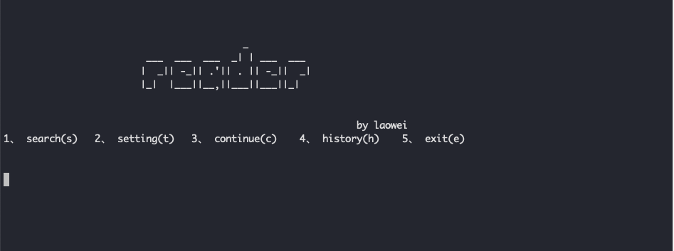
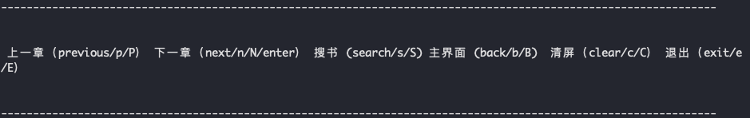
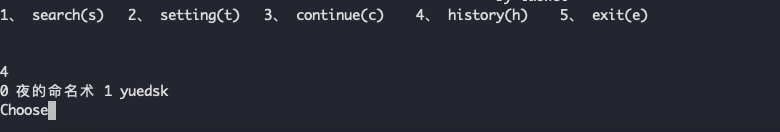

# reader
 一款全平台开源命令行读书软件


## 文件说明
- reader.py  主程序
- reader.db  数据库文件，用于存储一些经常会修改的设置选项及历史记录
- config.yaml  用于存储一些不常修改的设置，包括各个书源的地址，正则等

  
## 使用说明
- 主界面
-   
  - 搜书  search （1/s/search）
  - 设置  setting  （2/t/setting)
  - 继续阅读  continue  (3/c/continue/回车键)
  - 历史记录 history (4/h/history)
  - 退出  exit  （5/e/exit)  
  

- 阅读界面
-   
  - 上一章  （p/P/previous）
  - 下一章  （next/n/N/回车键）
  - 搜书界面  （search/s/S）
  - 主界面   （back/b/B）
  - 清屏   （clear/c/C）
  - 退出  （exit/e/E）
  
  - 设置界面
  - 
    - 选择书源
  - 历史界面
  - 
    - 选择阅读过的书籍
  
## 书源说明
```
yuedsk:
      name: "阅读库"        # 名称
      url:                 # url 配置
        chapter:           # 章节 配置
          url: '{c}'       # 地址  
          method: GET      # 请求方式
          type: xpath      #type配置
          encoding: utf-8  # 编码
        content:           # 内容配置
          url: '{o}'
          method: GET
          type: xpath      #type配置
          encoding: utf-8
        search:            # 搜索配置
          url: http://www.yuedsk.com/modules/article/search.php?q={k}
          method: GET
          type: xpath      #type配置
          encoding: utf-8
      xpath:               # xpath
        chapter_name: //li[@class="chapter"]/a/text()
        chapter_path: //li[@class="chapter"]/a/@href
        content: //div[@id="clickeye_content"]/text()
        search_name: //div[@class="c_row"]/div[2]/div[1]/span/a/text()
        search_path: //div[@class="c_row"]/div[2]/div[1]/a/@href
      proxies:             # 代理
      verify: true         # 证书验证
      cookie:              # cookie

```

## 其他说明
- 目前默认三个书源，其余书源有时间会更新
- 支持post/get请求方式
- 暂时只支持xpath筛选
- 支持代理，需各个书源各个配置
- 暂不支持中途换源

## 开发计划
- 支持换源  
- 支持正则筛选     ✅
- 支持cookie      ✅

## 补充说明
- 个人开发者，比较懒散，更新随缘


## 12.5 更新

- 配置文件新增cookie选项
- 程序新增Content-Type 为application/x-www-form-urlencoded，如后续其他书源不能使用这个选项，会考虑在配置文件中分别配置
- 新增两个书源
- 简单优化

## 12.9 更新
- 配置文件新增type 选项，可以自定筛选规则为xpath，json，或是re
- 支持json，正则
- 增加几个书源，主要是示范作用，其中番茄小说用了json，永恒小说用了正则